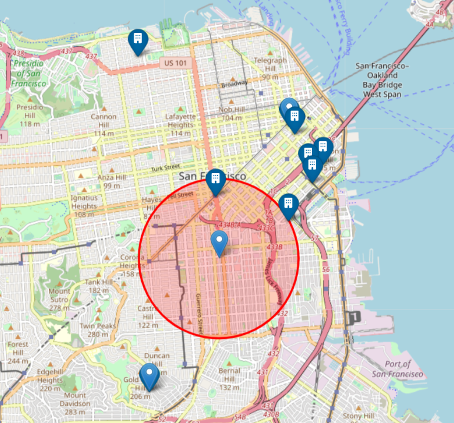
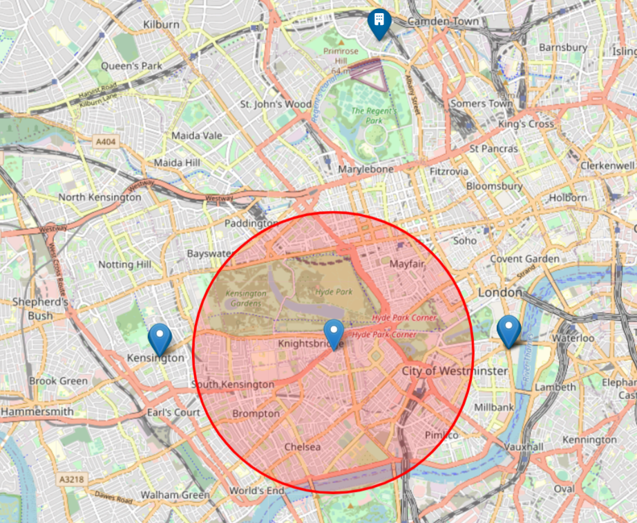
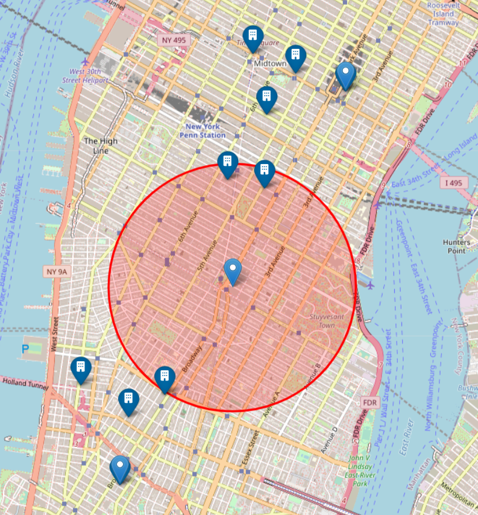
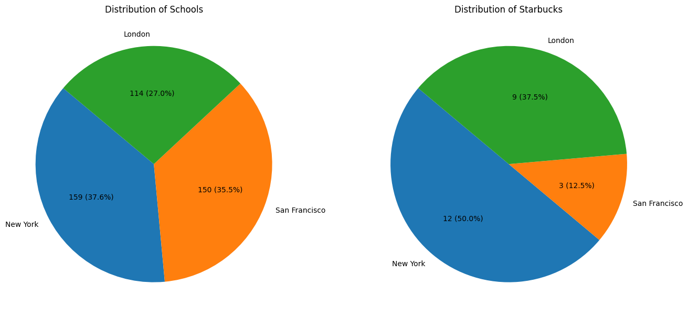
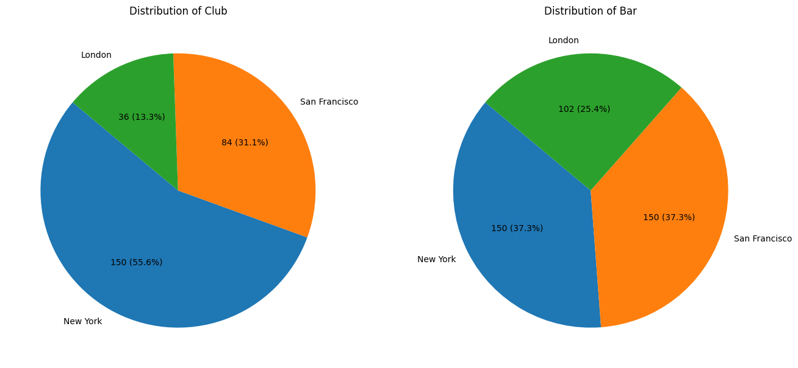
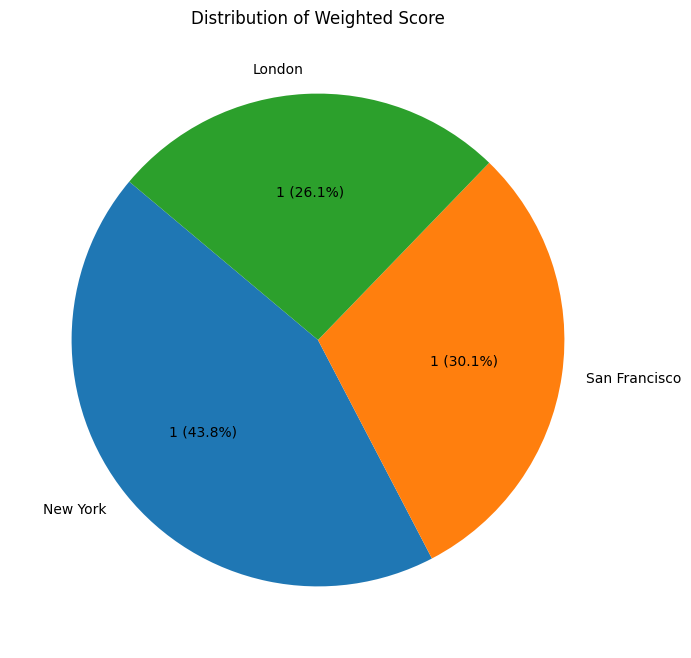
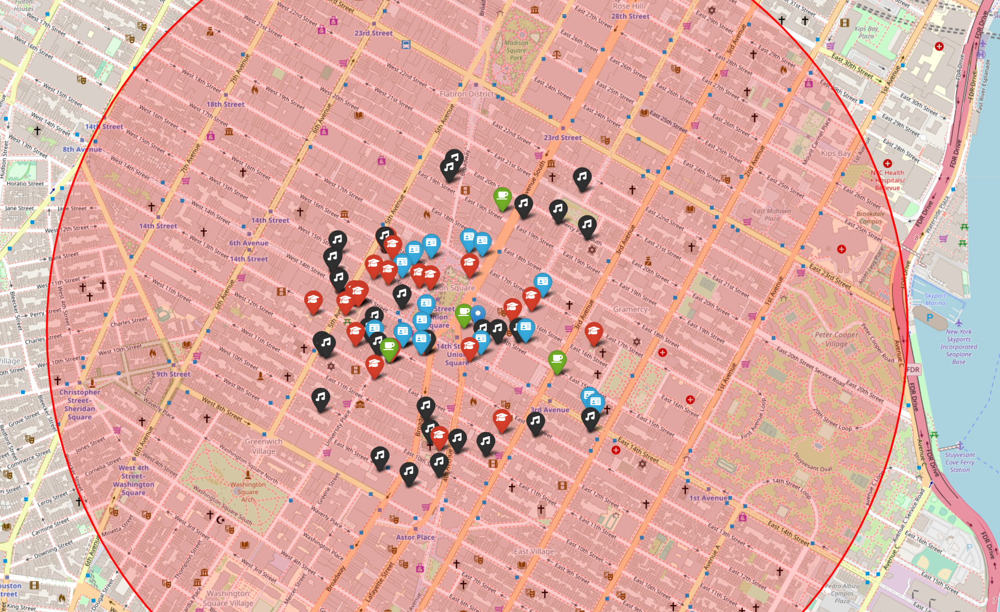

# Project III - Optimal Gaming Company Office Location

## Introduction

Welcome to our gaming company's office location analysis project! We embarked on an exciting quest to identify the best city for our new gaming company office. With a team diverse in roles and needs, our goal was to find a location that caters to everyone's requirements while promoting growth and efficiency.

## Project Goal

Our project aimed to analyze potential cities for our new office location, taking into account various criteria specific to our team's unique needs and preferences.

### Key Criteria:

- Proximity to Design Talks and Companies: A creative environment for our designers.
- Family-Friendly Areas: Considering that 30% of our staff have children.
- Vicinity to Tech Startups: An inspiring setting for our developers.
- Access to Starbucks: A must-have for our executives.
- Travel Accessibility: Essential for account managers.
- Entertainment Options: Suitable for our team's age group (25-40 years).
- Vegan Options: Catering to our CEO's dietary preferences.
- Basketball Facilities: For our sports-loving maintenance staff.
- Pet Care Services: For the company's beloved dog, Dobby.

# Methodology

We employed a two-pronged approach, combining database queries and API calls to gather comprehensive data on each location.

### Approaches:
1. Database Analysis: Filtering existing companies based on specific criteria.
2. API Utilization: Exploring the surroundings of potential locations for amenities and services.
3. City Comparison: Assessing different cities based on our criteria to determine the most suitable option.

### Tools & Technologies Used:
- MongoDB for database queries.
- Foursquare API for location-based information.
- Data visualization tools like Matplotlib and Seaborn.
### Analysis and Findings
Our analysis led us to compare three major cities: New York, San Francisco, and London. We measured and weighted various factors like the number of schools, Starbucks outlets, bars, and clubs.
#### City Comparisons:
- San Francisco Gaming Companies:

- London Gaming Companies:

- New York Gaming Companies:

### Distribution Analysis:

- Distribution of Schools and Starbucks:

- Distribution of bars and clubs:

### Weighted Score Comparison:

### Key Findings:
- Optimal Choice: New York stood out as the most favorable location, striking a balance across all our evaluation metrics.
- Unique Strengths: While San Francisco and London showed potential, they had distinct advantages and limitations compared to New York.

## Conclusion
After thorough data-driven analysis, New York stood out as the best location for our gaming company. Its vibrant culture, abundance of amenities, and proximity to tech hubs make it an ideal choice for fostering growth and catering to our diverse team.

- New York Gaming Companies + distribution of Schools, Starbucks, bars and clubs:

### Future Considerations
- Expanding Criteria: Including more lifestyle and cultural factors.
- Detailed Neighborhood Analysis: Delving deeper into specific areas within the chosen city.

### Thank You!
We hope this README provides a clear overview of our project's journey, methodology, and conclusions. Our team is excited about the prospect of setting up our new office in New York, and we look forward to growing in this dynamic environment!

For more details, feel free to explore our [Presentation]() and check out the visualizations included in our project repository.